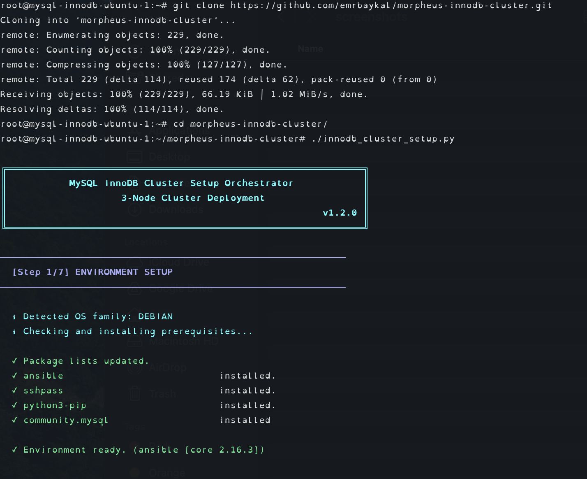
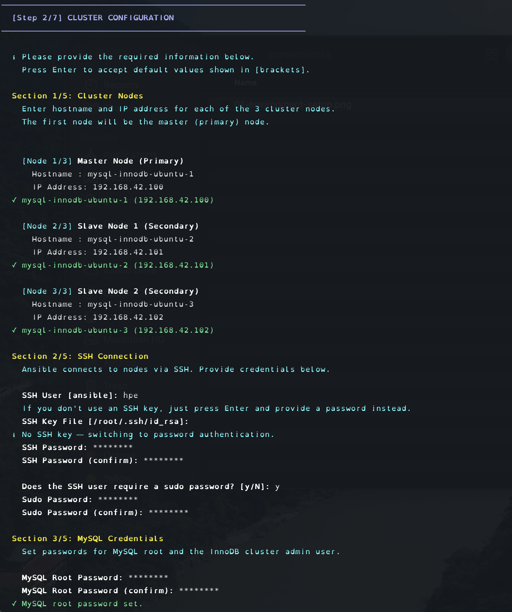
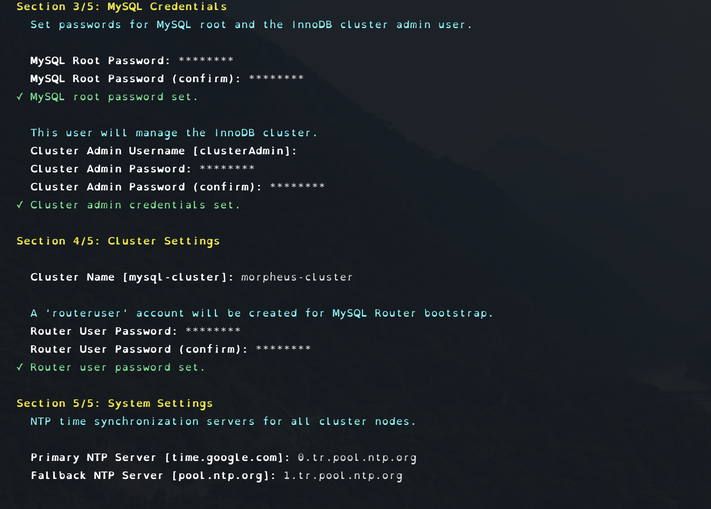
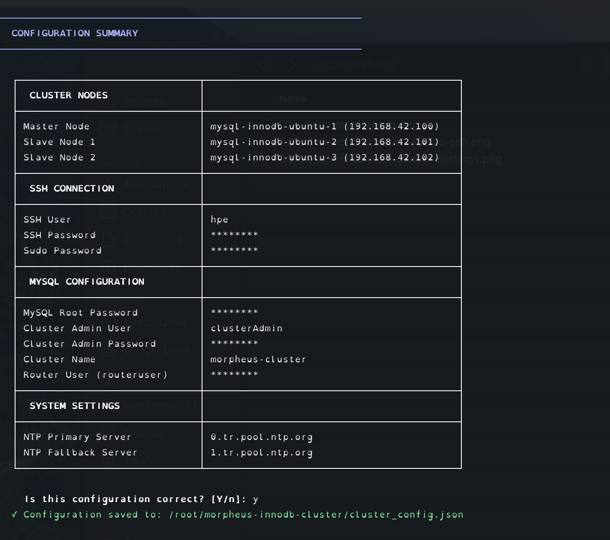
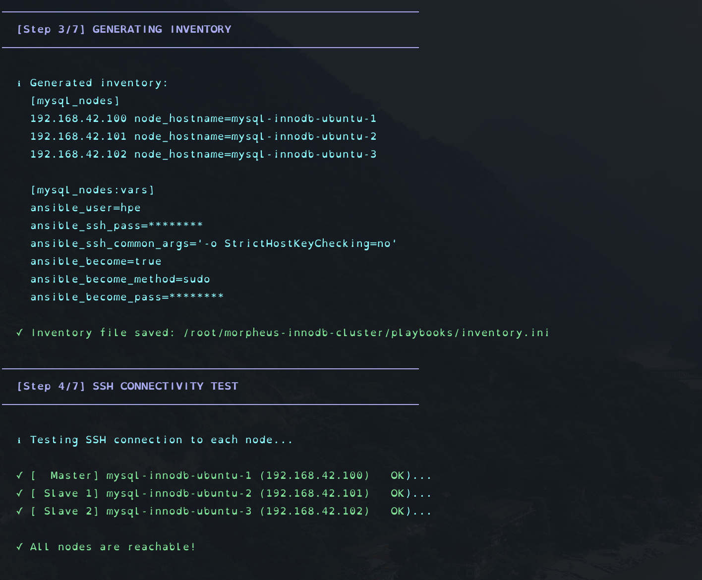
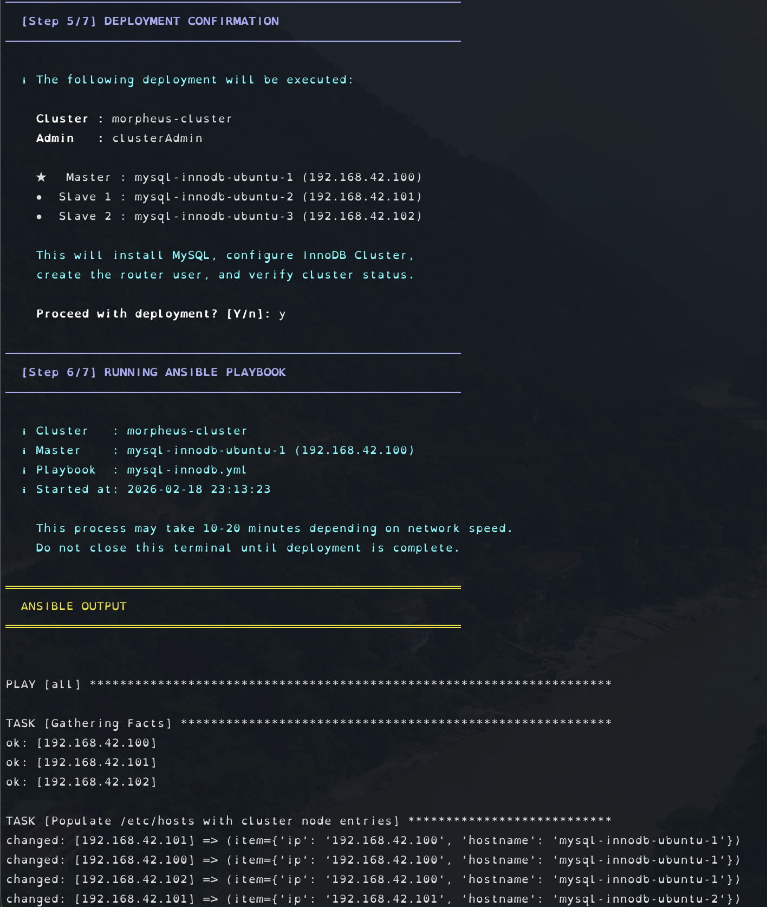
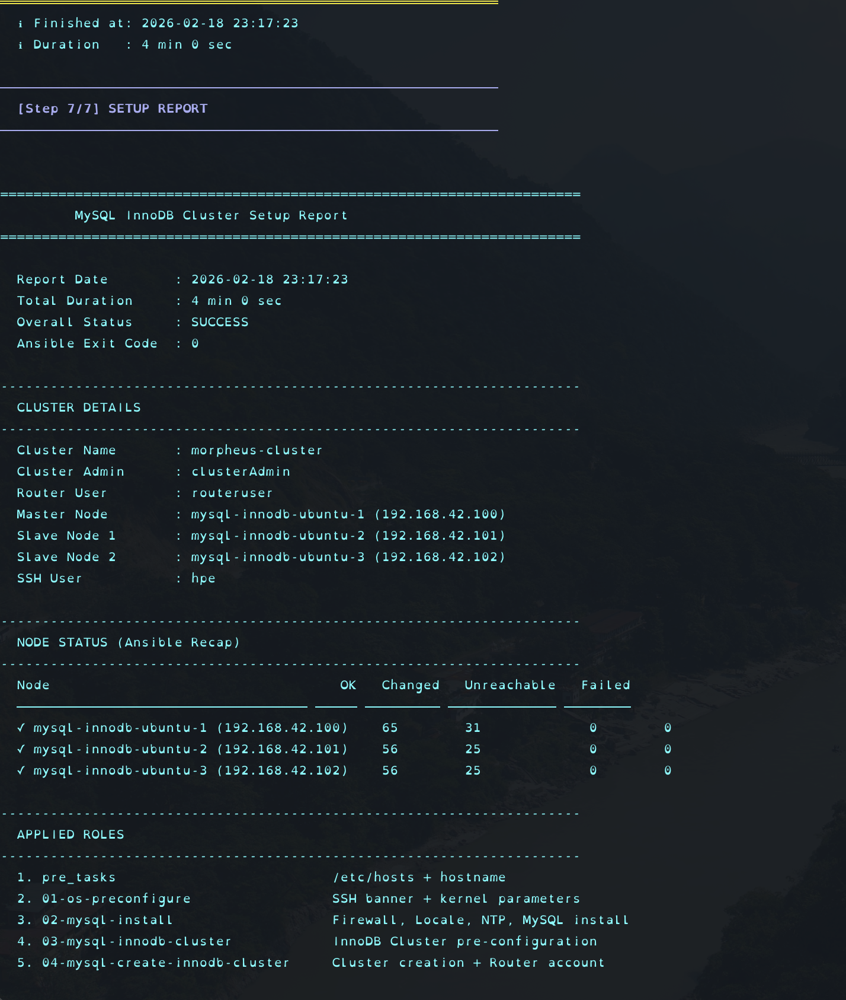
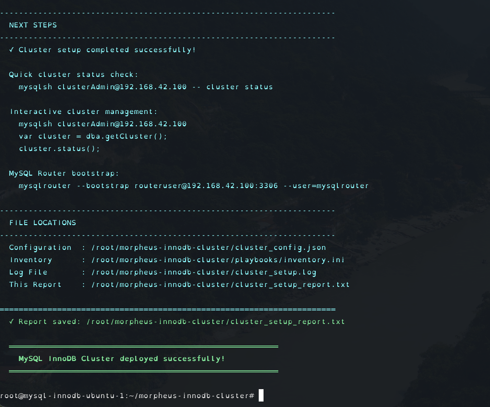

# MySQL InnoDB Cluster — Morpheus Setup

Automated deployment of a 3-node MySQL 8.0 InnoDB Cluster on Ubuntu and RedHat-based systems, orchestrated by a single interactive Python script backed by modular Ansible roles.

---

## Screenshots

### Step 1/7 — Environment Setup
Detects the local OS family and automatically installs all required prerequisites (Ansible, sshpass, python3-pip, community.mysql collection).



---

### Step 2/7 — Cluster Configuration (Nodes & SSH)
Interactive wizard collects hostnames and IP addresses for all 3 cluster nodes, then SSH credentials (key or password authentication, sudo escalation).



---

### Step 2/7 — Cluster Configuration (MySQL & System)
Collects MySQL root and cluster admin credentials, cluster name, router user password, and NTP server settings.



---

### Configuration Summary
All collected parameters are presented in a structured summary table before saving. User confirms with `y` to proceed.



---

### Step 3 & 4/7 — Inventory Generation & SSH Connectivity Test
Ansible inventory is auto-generated from collected inputs (IP-based, DNS-independent). SSH connectivity to all 3 nodes is validated before deployment.



---

### Step 5 & 6/7 — Deployment Confirmation & Ansible Execution
Final confirmation before Ansible runs. Playbook output streams in real-time with all task results visible.



---

### Step 7/7 — Play Recap & Setup Report
Ansible PLAY RECAP parsed and presented as a structured node status table with success/failure counts.



---

### Applied Roles, Next Steps & File Locations
All applied roles listed with descriptions. Next steps for cluster management and MySQL Router bootstrap provided.



---

## Directory Structure

```
morpheus-innodb-cluster/
├── innodb_cluster_setup.py            # Main orchestrator script (v1.2.0)
├── README.md
│
├── playbooks/
│   ├── mysql-innodb.yml               # Main Ansible playbook entry point
│   │
│   ├── 01-os-preconfigure/            # Role: OS hardening & kernel tuning
│   │   ├── defaults/main.yml
│   │   ├── vars/main.yml              # sysctl parameters
│   │   ├── tasks/
│   │   │   ├── main.yml              # OS-family dispatcher
│   │   │   ├── debian.yml            # Ubuntu/Debian tasks
│   │   │   └── redhat.yml            # RHEL/CentOS/Rocky/Alma tasks
│   │   ├── handlers/main.yml
│   │   ├── files/issue.net           # SSH login banner text
│   │   └── meta/main.yml
│   │
│   ├── 02-mysql-install/              # Role: MySQL 8.0 installation
│   │   ├── defaults/main.yml
│   │   ├── vars/main.yml
│   │   ├── tasks/
│   │   │   ├── main.yml              # OS-family dispatcher
│   │   │   ├── debian.yml            # apt-based install + systemd drop-in
│   │   │   └── redhat.yml            # dnf/yum-based install + systemd drop-in
│   │   ├── handlers/main.yml
│   │   └── meta/main.yml
│   │
│   ├── 03-mysql-innodb-cluster/       # Role: InnoDB Cluster pre-configuration
│   │   ├── defaults/main.yml
│   │   ├── vars/main.yml
│   │   ├── tasks/main.yml
│   │   ├── handlers/main.yml
│   │   └── meta/main.yml
│   │
│   ├── 04-mysql-create-innodb-cluster/ # Role: Cluster creation (master node only)
│   │   ├── defaults/main.yml
│   │   ├── vars/main.yml
│   │   ├── tasks/main.yml
│   │   ├── handlers/main.yml
│   │   └── meta/main.yml
│   │
│   # Generated at runtime:
│   └── inventory.ini
│
# Generated at runtime:
├── cluster_config.json                # Saved user configuration (reused on re-runs)
├── cluster_setup.log                  # Full Ansible output log
└── cluster_setup_report.txt           # Post-deployment summary report
```

---

## Supported Operating Systems

| OS Family | Tested Distributions |
|-----------|---------------------|
| Debian    | Ubuntu 22.04 / 24.04 |
| RedHat    | RHEL 8/9 |

Playbooks automatically detect `ansible_os_family` and execute the appropriate tasks for each distribution.

---

## Prerequisites

**On the node where you run the script:**
- Python 3.6+
- `sudo` access

**On all 3 target cluster nodes:**
- Ubuntu 22.04+ or RHEL/CentOS 8+
- SSH access (key-based or password)
- `sudo` privileges
- Internet access (for MySQL repository download)

The script automatically installs all missing components on the local node:

| Component | Method |
|-----------|--------|
| `sshpass` | OS package manager |
| `python3-pip` | OS package manager |
| `ansible` | pip |
| `community.mysql` | ansible-galaxy |

---

## Quick Start

> Run the following commands only on the server designated as the **master node** of the MySQL InnoDB Cluster.

```bash
git clone https://github.com/emrbaykal/morpheus-innodb-cluster.git
cd morpheus-innodb-cluster
sudo python3 innodb_cluster_setup.py
```

The script guides you through a 7-step interactive wizard:

| Step | Phase | Description |
|------|-------|-------------|
| 1/7  | Environment Setup | Detects OS, installs prerequisites |
| 2/7  | Cluster Configuration | Collects all cluster variables (5 sections) |
| 3/7  | Inventory Generation | Creates Ansible inventory from inputs |
| 4/7  | SSH Connectivity Test | Verifies all nodes are reachable |
| 5/7  | Deployment Confirmation | Reviews configuration before execution |
| 6/7  | Ansible Playbook Execution | Streams real-time output, logs to file |
| 7/7  | Setup Report | Parses recap, generates summary report |

**Typical duration:** 10–20 minutes depending on network speed.

---

## Configuration Variables

The wizard collects the following information across 5 sections:

### Section 1/5 — Cluster Nodes

For each of the 3 nodes (1 master + 2 secondary):

| Field | Example |
|-------|---------|
| Hostname | `mysql-innodb-ubuntu-1` |
| IP Address | `192.168.42.100` |

> Connectivity is IP-based throughout. DNS is not required — `/etc/hosts` is automatically populated on all nodes.

### Section 2/5 — SSH Connection

| Field | Default | Notes |
|-------|---------|-------|
| SSH User | `ansible` | User for Ansible connections |
| SSH Key File | `~/.ssh/id_rsa` | Leave empty to use password auth |
| SSH Password | — | Used if no key file provided |
| Sudo Password | — | Required if user needs password for `sudo` |

### Section 3/5 — MySQL Credentials

| Field | Default | Notes |
|-------|---------|-------|
| MySQL Root Password | — | Alphanumeric recommended |
| Cluster Admin Username | `clusterAdmin` | Manages the InnoDB Cluster |
| Cluster Admin Password | — | Alphanumeric recommended |

### Section 4/5 — Cluster Settings

| Field | Default | Notes |
|-------|---------|-------|
| Cluster Name | `mysql-cluster` | InnoDB Cluster identifier |
| Router User Password | — | For `routeruser` MySQL Router account |

### Section 5/5 — System Settings

| Field | Default |
|-------|---------|
| Primary NTP Server | `time.google.com` |
| Fallback NTP Server | `pool.ntp.org` |

All values are saved to `cluster_config.json` (mode `0600`). On subsequent runs the script offers to reuse the saved configuration.

---

## What Gets Deployed

### Pre-tasks — All Nodes
- Populate `/etc/hosts` with all cluster node entries (IP + hostname pairs)
- Set system hostname via Ansible `hostname` module

### Role 01 — OS Pre-configuration

Applied to all nodes. Hardens the OS and tunes kernel parameters for database workloads.

| Task | Debian/Ubuntu | RedHat/CentOS |
|------|--------------|---------------|
| SSH banner | Deploy to `/etc/issue.net`, drop-in `/etc/ssh/sshd_config.d/99-banner.conf` | Deploy to `/etc/issue.net`, update `sshd_config` (EL8) or drop-in (EL9) |
| Security framework | Stop & disable AppArmor | SELinux → permissive |
| Firewall | Disable UFW | Stop & disable firewalld |
| Locale | `locale_gen` (en_US.UTF-8) | `glibc-langpack-en` + `localedef` |
| NTP | `systemd-timesyncd` | `chrony` |
| Package locks | Stop `unattended-upgrades`, clear apt/dpkg locks | — |
| MySQL limits | `/etc/security/limits.d/99-mysql.conf` | `/etc/security/limits.d/99-mysql.conf` |
| Transparent Huge Pages | Disabled (enabled + defrag) | Disabled |
| Kernel parameters | `/etc/sysctl.d/99-01-os-preconfigure.conf` | `/etc/sysctl.d/99-01-os-preconfigure.conf` |
| GRUB | `transparent_hugepage=never` appended | `transparent_hugepage=never` appended |

**Kernel parameters tuned (sysctl):**

| Parameter | Value | Purpose |
|-----------|-------|---------|
| `net.core.somaxconn` | 65535 | Max socket connection queue |
| `net.ipv4.tcp_max_syn_backlog` | 65535 | TCP SYN backlog |
| `net.ipv4.tcp_fin_timeout` | 15 | Faster TIME_WAIT cleanup |
| `net.ipv4.tcp_tw_reuse` | 1 | Reuse TIME_WAIT sockets |
| `vm.swappiness` | 10 | Minimize swap usage |
| `vm.dirty_ratio` | 15 | Dirty page write threshold |
| `fs.file-max` | 2097152 | Max open file descriptors |
| `fs.aio-max-nr` | 1048576 | Async I/O limit |

**MySQL system limits applied (`/etc/security/limits.d/99-mysql.conf`):**
```
mysql soft nofile 65535
mysql hard nofile 65535
mysql soft nproc  65535
mysql hard nproc  65535
mysql soft memlock unlimited
mysql hard memlock unlimited
```

---

### Role 02 — MySQL 8.0 Installation

Applied to all nodes. Installs MySQL 8.0 from the official MySQL repository.

| Task | Debian/Ubuntu | RedHat/CentOS |
|------|--------------|---------------|
| Repository | `mysql-apt-config` deb from `repo.mysql.com` | MySQL YUM repo RPM (EL8/EL9 auto-detected) |
| Packages | mysql-server, mysql-client, mysql-shell, python3-mysqldb, libmysqlclient-dev, numactl | mysql-server, mysql, mysql-shell, python3-PyMySQL, mysql-devel, numactl |
| Version lock | `dpkg_selections` hold | `yum-plugin-versionlock` or `python3-dnf-plugin-versionlock` |
| Service name | `mysql` | `mysqld` |
| CRB repo | — | Enabled automatically (Rocky/Alma detection) |

**systemd drop-in applied to MySQL service (both OS families):**
```ini
[Service]
LimitNOFILE=65535
LimitNPROC=65535
LimitMEMLOCK=infinity
ExecStart=/usr/bin/numactl --interleave=all /usr/sbin/mysqld
```

Common tasks:
- Start and enable MySQL service
- Set MySQL root password with `caching_sha2_password` (idempotent: handles both fresh install and re-runs)
- Verify service is running

---

### Role 03 — InnoDB Cluster Pre-configuration

Applied to all nodes. Prepares each MySQL instance for cluster membership.

1. **Create Cluster Admin User**
   - Full `ALL PRIVILEGES ON *.*` with `GRANT OPTION`
   - Authentication: `caching_sha2_password`

2. **Database Cleanup**
   - Remove anonymous users
   - Drop `test` database and its privilege entries

3. **InnoDB Configuration** written to OS-specific path:
   - Debian: `/etc/mysql/mysql.conf.d/innodb-mysqld.cnf`
   - RedHat: `/etc/my.cnf.d/innodb-mysqld.cnf`

```ini
[mysqld]
bind-address                    = 0.0.0.0
max_connections                 = 451
innodb_buffer_pool_size         = {80% of total RAM}G
innodb_use_fdatasync            = ON
innodb_numa_interleave          = ON
sql_generate_invisible_primary_key = 1
binlog_expire_logs_seconds      = 604800
binlog_expire_logs_auto_purge   = ON
gtid_mode                       = ON
enforce_gtid_consistency        = ON
server_id                       = {last octet of node IP}

[mysqldump]
set-gtid-purged = OFF
```

4. **Restart MySQL** and verify all parameters applied correctly

---

### Role 04 — Cluster Creation (Master Node Only)

Runs **only on the primary node** (`when: inventory_hostname == master_hostname`).

1. **Wait for port 3306** on all cluster nodes (timeout: 480s)
2. **Configure instances** via MySQL Shell (`dba.checkInstanceConfiguration` → `dba.configureInstance`)
3. **Create cluster** on primary: `dba.createCluster(clusterName)`
4. **Add secondary nodes**: `cluster.addInstance(host, {recoveryMethod: 'clone'})`
5. **Verify cluster status**: `cluster.status()`
6. **Create router account**: `cluster.setupRouterAccount('routeruser')` (idempotent with `{update: true}`)
7. **Cleanup** temporary credential and JS script files from `/tmp/`

---

## Re-running

The entire workflow is idempotent and safe to re-run:

```bash
# Re-run with saved configuration
sudo python3 innodb_cluster_setup.py

# Start fresh (delete saved config first)
sudo rm cluster_config.json
sudo python3 innodb_cluster_setup.py
```

| Concern | Behavior |
|---------|----------|
| Configuration | Loads `cluster_config.json` automatically; offers to reuse |
| MySQL root password | Tries socket auth first, then existing password |
| Router account | Uses `{update: true}` if `routeruser` already exists |
| Packages | Checks current state before installing |
| Cluster creation | Will fail if cluster already exists — use `dba.rebootClusterFromCompleteOutage()` manually |

---

## Post-Deployment

```bash
# Quick cluster status check
mysqlsh clusterAdmin@<master-ip> -- cluster status

# Interactive cluster management
mysqlsh clusterAdmin@<master-ip>
var cluster = dba.getCluster();
cluster.status();

# Bootstrap MySQL Router
mysqlrouter --bootstrap routeruser@<master-ip>:3306 --user=mysqlrouter
```

---

## Network Ports

Ensure these ports are open **between all cluster nodes** (bidirectional):

| Port  | Protocol | Service |
|-------|----------|---------|
| 3306  | TCP | MySQL Classic Protocol |
| 33060 | TCP | MySQL X Protocol |
| 33061 | TCP | Group Replication |

---

## Security Features

- SSH key authentication preferred; password auth as fallback
- `sudo` password support for privilege escalation
- All generated config files: mode `0600`
- Passwords never logged (`no_log: true` on sensitive tasks)
- Terminal input masked for all password prompts
- SSH login banner configured (`/etc/issue.net`)
- SELinux set to permissive (RedHat) / AppArmor disabled (Debian)
- Transparent Huge Pages disabled (MySQL performance requirement)
- MySQL file descriptor and memory lock limits raised
- NUMA-aware MySQL execution via `numactl --interleave=all`
- Temporary cluster script files cleaned up from `/tmp/` after use

---

## Files Generated at Runtime

| File | Location | Mode | Purpose |
|------|----------|------|---------|
| `cluster_config.json` | Project root | `0600` | Saved user configuration (reusable) |
| `inventory.ini` | `playbooks/` | `0600` | Ansible inventory (auto-generated) |
| `.extra_vars.json` | `playbooks/` | `0600` | Temporary extra-vars (removed after run) |
| `cluster_setup.log` | Project root | — | Full Ansible output log |
| `cluster_setup_report.txt` | Project root | — | Deployment summary report |

---

## Troubleshooting

| Issue | Solution |
|-------|----------|
| `Missing sudo password` | Re-run and answer `y` to the sudo password prompt |
| `dpkg lock` on Debian | Script waits and clears locks automatically; also disables `unattended-upgrades` |
| Root password task fails on re-run | Task is idempotent — tries socket auth first, then existing password |
| Role 04 skipped on all nodes | Ensure `master_hostname` matches the master node IP in inventory |
| Cluster creation fails with "already exists" | Run `dba.dropMetadataSchema()` in MySQL Shell then retry |
| SSH connectivity test fails | Check firewall rules; script allows override to continue anyway |
| `community.mysql` not found | Script installs it automatically via `ansible-galaxy` |

---

## License

MIT License

Copyright (c) 2026 Emre Baykal

Permission is hereby granted, free of charge, to any person obtaining a copy
of this software and associated documentation files (the "Software"), to deal
in the Software without restriction, including without limitation the rights
to use, copy, modify, merge, publish, distribute, sublicense, and/or sell
copies of the Software, and to permit persons to whom the Software is
furnished to do so, subject to the following conditions:

The above copyright notice and this permission notice shall be included in all
copies or substantial portions of the Software.

THE SOFTWARE IS PROVIDED "AS IS", WITHOUT WARRANTY OF ANY KIND, EXPRESS OR
IMPLIED, INCLUDING BUT NOT LIMITED TO THE WARRANTIES OF MERCHANTABILITY,
FITNESS FOR A PARTICULAR PURPOSE AND NONINFRINGEMENT. IN NO EVENT SHALL THE
AUTHORS OR COPYRIGHT HOLDERS BE LIABLE FOR ANY CLAIM, DAMAGES OR OTHER
LIABILITY, WHETHER IN AN ACTION OF CONTRACT, TORT OR OTHERWISE, ARISING FROM,
OUT OF OR IN CONNECTION WITH THE SOFTWARE OR THE USE OR OTHER DEALINGS IN THE
SOFTWARE.
