# Automating MySQL InnoDB Cluster Deployment for HPE Morpheus Enterprise HA Environments

**A single Python script that turns a painful, multi-hour manual process into a guided 10-minute deployment.**

> 🔗 **GitHub Repository:** [emrbaykal/morpheus-innodb-cluster](https://github.com/emrbaykal/morpheus-innodb-cluster)
>
> 👤 **Author:** Emre Baykal
>
> 📜 **License:** MIT

---

## TL;DR

If you deploy **HPE Morpheus Enterprise** in a 3-Node HA configuration, the installer automatically clusters the Application Tier, OpenSearch, and RabbitMQ — but leaves the **Transactional Database Tier (MySQL)** entirely in your hands. You must stand up a resilient, production-grade MySQL InnoDB Cluster *before* you can even start the Morpheus HA installation.

The [**morpheus-innodb-cluster**](https://github.com/emrbaykal/morpheus-innodb-cluster) project solves this with a single interactive Python script backed by modular Ansible roles — it turns a multi-day manual task into a **guided wizard**.

---

## Introduction

If you've ever deployed HPE Morpheus Enterprise in a High Availability (HA) configuration, you know the drill: the application tier, messaging tier, and non-transactional database tier all install and cluster automatically across your three nodes — but the **Transactional Database Tier** is left entirely in your hands. That tier is MySQL, and for a production HA environment, it needs to be a properly configured, redundant, multi-node cluster.

As the [HPE Morpheus Enterprise v8.1.0 HA Installation Overview](https://support.hpe.com/hpesc/public/docDisplay?docId=sd00007510en_us&page=GUID-C1061ACC-BCAF-4F7C-A413-2219EAFB7983.html) clearly states:

> *"In this architecture, all tiers are deployed on three machines by HPE Morpheus Enterprise during the installation, with the exception of the Transactional Database Tier. This provides HA not just for the HPE Morpheus Enterprise Application Tier but all underlying tiers that support HPE Morpheus Enterprise. The Transactional Database Tier will remain external, either as a separate cluster or PaaS, following the supported services. An external MySQL cluster must still be set up outside of the HPE Morpheus Enterprise app nodes."*

This means **you** are responsible for standing up a resilient, properly tuned MySQL cluster **before** you can even begin the Morpheus HA installation. There is no embedded option — Morpheus disables its internal MySQL (`mysql['enable'] = false`) and expects you to provide an external endpoint.

This is where the **morpheus-innodb-cluster** project comes in. It is a single interactive Python script, backed by modular Ansible roles, that automates the entire process of deploying a production-ready 3-node MySQL InnoDB Cluster on Ubuntu or RHEL-based systems.

In this post, I'll walk you through why this tool exists, what problems it solves, and how to use it from start to finish.

---

## Understanding HPE Morpheus Enterprise HA Architecture

HPE Morpheus Enterprise is a unified hybrid cloud management platform that provides provisioning, orchestration, monitoring, and governance across private and public clouds. It can start as a simple single-machine instance, or it can be split into individual services per machine and configured in a high availability (HA) configuration.

According to the official HPE documentation (v8.1.0, February 2026), there are **four primary tiers** of services within the Morpheus appliance:

### 1. Application Tier

The stateless services layer — Nginx and Tomcat. These can be installed across all regions and placed behind a central load balancer or geo-based load balancer. Shared storage (NFS, Amazon S3, or OpenStack Swift) is required for deployment archives, virtual image catalogs, and backups.

### 2. Transactional Database Tier (MySQL) 🎯

This is the focus of this article. The HPE documentation states: *"The Transactional Database tier consists of a MySQL compatible database. It is recommended that a lockable clustered configuration be used, such as a Galera cluster, which can also provide high availability."* For the recommended 3-Node HA architecture, this tier **must be external** — it is not deployed by the Morpheus installer.

### 3. Non-Transactional Database Tier (OpenSearch)

Used for log aggregation, stats, metrics, and temporal data. Morpheus clusters OpenSearch **automatically** during installation — no manual setup required.

### 4. Messaging Tier (RabbitMQ)

An AMQP-based tier with STOMP protocol for agent communication. RabbitMQ needs at least 3 instances for HA. While RabbitMQ is installed automatically during Morpheus setup, it **does require manual clustering** afterward.

### The Architecture Diagram

The recommended 3-Node HA deployment looks like this: three Morpheus application nodes sit behind a load balancer, each running embedded RabbitMQ and OpenSearch. On the side, a **separate 3-node MySQL Database Cluster** provides the transactional database tier, connected via port 3306. Shared storage connects to all application nodes.

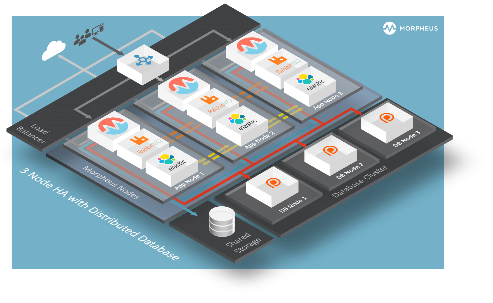

*HPE Morpheus Enterprise 3-Node HA Architecture — the external MySQL cluster on the right is exactly what this tool automates.*

---

## MySQL Requirements for Morpheus HA

The [HPE 3-Node HA Install documentation](https://support.hpe.com/hpesc/public/docDisplay?docId=sd00007510en_us&page=GUID-2D8A0A86-2231-4239-AB44-5475B4AE0827.html) specifies the following MySQL requirements:

- **MySQL version v8.0.x** (minimum of v8.0.32); the Morpheus documentation lists **MySQL 8.4 LTS** as supported for external clusters from Morpheus 9.1.0
- **MySQL cluster with at least 3 nodes** for redundancy
- **Morpheus application nodes must have connectivity** to the MySQL cluster

There is also an important note: *"Morpheus does not create primary keys on all tables. If you use a clustering technology that requires primary keys, you will need to leverage the invisible primary key option in MySQL 8."*

Once the MySQL cluster is up, you must create the Morpheus database and user **before** installing Morpheus itself:

```sql
-- Create the Morpheus database
CREATE DATABASE morpheus CHARACTER SET utf8mb4 COLLATE utf8mb4_general_ci;

-- Create the Morpheus database user
CREATE USER 'morpheus'@'%' IDENTIFIED BY 'morpheusDbUserPassword';

-- Grant required permissions
GRANT ALL PRIVILEGES ON morpheus.* TO 'morpheus'@'%' WITH GRANT OPTION;
GRANT SELECT, PROCESS, SHOW DATABASES, RELOAD ON *.* TO 'morpheus'@'%';
FLUSH PRIVILEGES;
```

Then, in each Morpheus app node's `/etc/morpheus/morpheus.rb`, you configure:

```ruby
mysql['enable'] = false
mysql['host'] = {'127.0.0.1' => 6446}   # MySQL Router local endpoint
mysql['morpheus_db'] = 'morpheus'
mysql['morpheus_db_user'] = 'morpheus'
mysql['morpheus_password'] = 'morpheusDbUserPassword'
```

Notice `mysql['enable'] = false` — this tells Morpheus to skip its embedded MySQL and use your external cluster instead. The host points to `127.0.0.1:6446`, which is the **MySQL Router** read-write endpoint running locally on each app node.

---

## The Pain of Manual MySQL InnoDB Cluster Setup

The HPE documentation tells you that you need an external MySQL cluster, but it doesn't deploy one for you. You're on your own. Here's what you're typically facing:

**1. Repetitive Per-Node Configuration** — OS tuning, kernel parameters, firewall rules for ports 3306, 33060, and 33061, NTP sync, locale settings, and MySQL installation on every node.

**2. MySQL Installation Complexity** — Repository management, correct stream/version selection, package locks, and systemd overrides. On RHEL, you also deal with AppStream module conflicts.

**3. InnoDB-Specific Tuning** — Enable GTID mode, enforce GTID consistency, set unique `server_id`, tune `innodb_buffer_pool_size` to RAM, configure binary log expiration, and bind addresses correctly.

**4. Cluster Bootstrap Choreography** — `dba.configureInstance()` on every node, `dba.createCluster()` on the primary, `cluster.addInstance()` for each secondary with the correct recovery method. Order matters.

**5. Security Considerations** — MySQL root passwords, cluster admin credentials, SSH keys, and sudo escalation — all of which need to be managed securely.

**6. OS-Specific Differences** — Ubuntu/Debian vs. RHEL differ in repository management, package names, services, paths, and security frameworks (AppArmor vs. SELinux).

Put it all together and you're looking at multiple hours — or days — of careful, error-prone work before you can even **begin** the Morpheus installation itself.

---

## Introducing morpheus-innodb-cluster

The **morpheus-innodb-cluster** project takes this manual work off your hands. It is a single Python script (`innodb_cluster_setup.py`) that walks you through a six-step wizard and then hands the actual configuration to four Ansible roles.

### Architecture at a Glance

```
You (on master node)
  └── innodb_cluster_setup.py  (Python orchestrator)
        ├── Steps 1-4:  environment, configuration, SSH + internet check, MySQL version
        ├── Step 5:     Ansible playbook
        │     ├── Role 01: OS pre-configuration
        │     ├── Role 02: MySQL installation
        │     ├── Role 03: InnoDB Cluster pre-configuration
        │     └── Role 04: Cluster creation (master only)
        └── Step 6:     Setup report
```

The script runs on the node that will become the cluster primary. It installs Ansible and `sshpass` if they are missing, connects to the three nodes over SSH and runs the playbook. Apart from Python 3 and sudo you do not need to prepare anything on that node, and no Ansible Galaxy collections are used.

| OS | MySQL Server comes from | MySQL Shell comes from |
|----|-------------------------|------------------------|
| RHEL 9 / 10 | Red Hat AppStream | repo.mysql.com tools repository |
| Ubuntu 24.04 / 26.04 | repo.mysql.com | repo.mysql.com |

On RHEL the server packages are Red Hat's own build, so a database problem can be raised with Red Hat support. MySQL Shell is not part of AppStream, which is why it comes from Oracle's tools repository.

---

## Step-by-Step Walkthrough

The screenshots below come from a deployment on three RHEL 9 nodes.

### Getting Started

Clone the repository and run the script on the node you want to be the **primary (master)** node:

```bash
git clone https://github.com/emrbaykal/morpheus-innodb-cluster.git
cd morpheus-innodb-cluster
sudo python3 innodb_cluster_setup.py
```

### Step 1/6 — Environment

The script detects the local OS and installs what is missing: `ansible-core` and `sshpass` on RHEL, `ansible` and `sshpass` on Ubuntu.

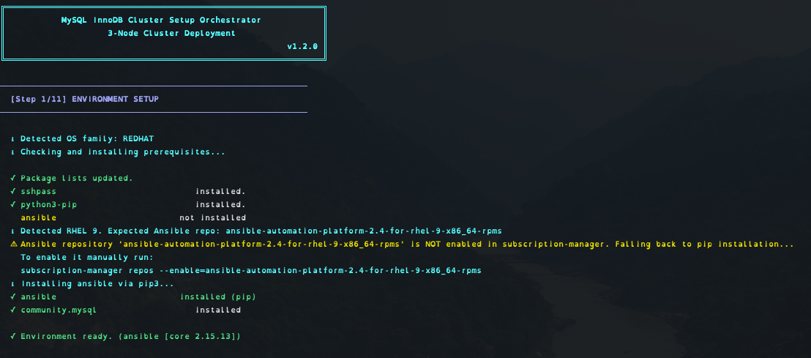

### Step 2/6 — Cluster Configuration

The wizard asks for the three nodes (hostname and IP; the first one is the master), the SSH user with a key or a password, the privilege escalation method (`sudo` or `dzdo`), the MySQL root password, the cluster admin user, the cluster name, the MySQL Router account (default name `routeruser`) and the NTP servers.

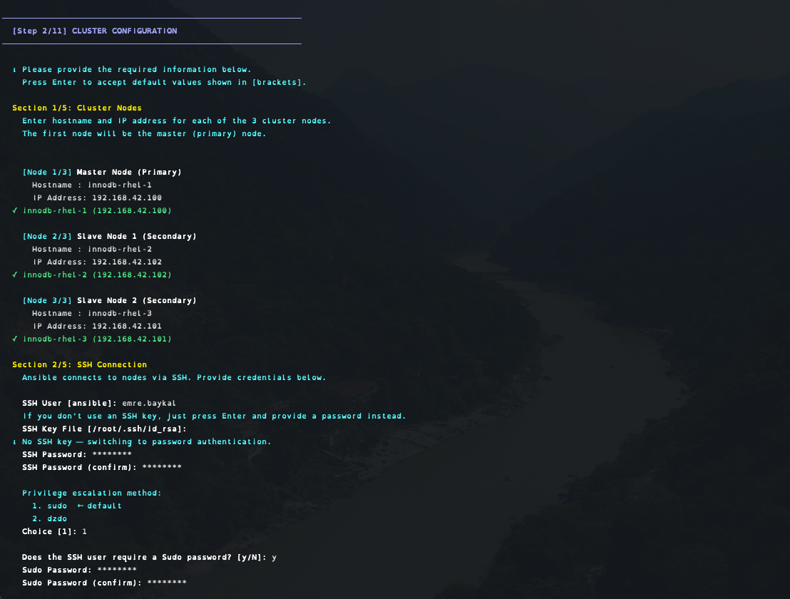

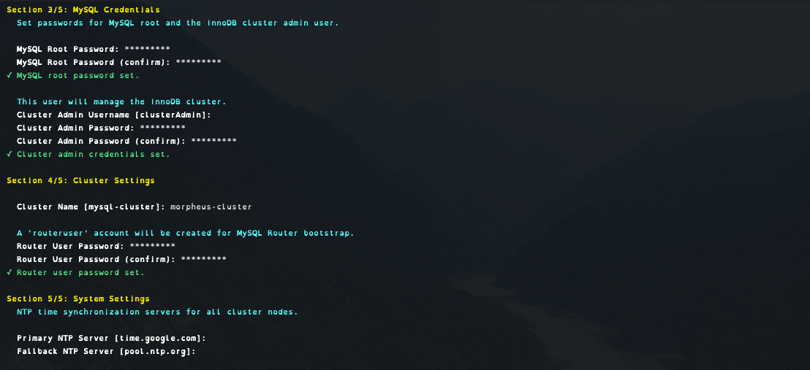

The last question is whether the passwords may be stored in `cluster_config.json`. If you answer no, the file keeps everything else, the script asks for the passwords on the next run, and the generated inventory is deleted when the run ends. Before anything is saved you get a summary to confirm.

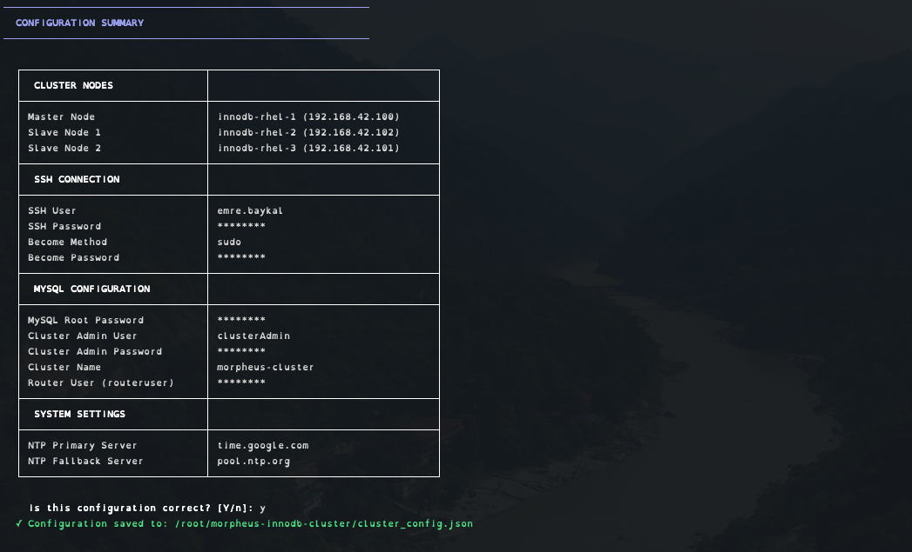

On a later run the saved answers are shown again. If you want to change something, every question comes back with the old value as its default, so you only retype what changed.

### Step 3/6 — Inventory, SSH and Internet Access

The script writes the Ansible inventory, pings every node over SSH and then checks that each node can reach `repo.mysql.com` over HTTPS. On RHEL it also refreshes the dnf metadata, which proves the node can reach its own repositories whether they come from the Red Hat CDN or a Satellite server. If a node fails either check the script stops here, because the version list and the installation in the next steps depend on it. The dnf refresh can take a minute on a freshly installed RHEL node.

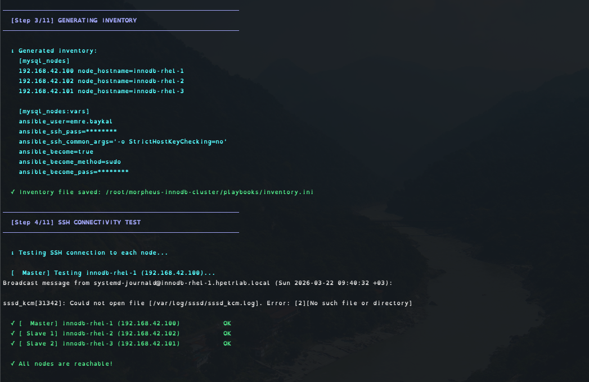

### Step 4/6 — MySQL Version

You choose the series first and then the exact version. Pick the series your Morpheus release supports: according to the Morpheus documentation, the 3-node HA database requirement is MySQL 8.0.x with a minimum of 8.0.32, and MySQL 8.4 LTS is supported for external clusters from Morpheus 9.1.0.

The version list is read live from the repository the node will install from. On RHEL it shows every `mysql-server` build AppStream carries for that series. On Ubuntu, Oracle's APT index only lists the newest build, so the script takes the newest version from the index and checks the repository pool for every older patch release that is still downloadable.

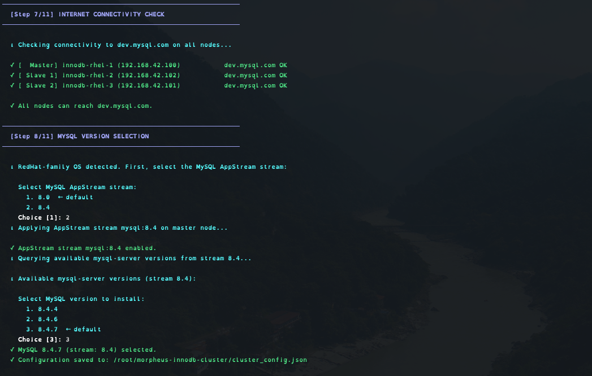

The newest version is the default. Whatever you pick is installed exactly, and all MySQL packages are then locked (`dnf versionlock` on RHEL, `apt-mark hold` on Ubuntu) so a routine OS update does not move the database. MySQL Shell is installed as the newest build of the same series; Oracle's Shell releases do not follow every AppStream build, and a newer Shell manages older servers of its series without issue.

### Step 5/6 — Deployment

After a final confirmation the playbook runs and its output streams to the terminal and to `cluster_setup.log`.

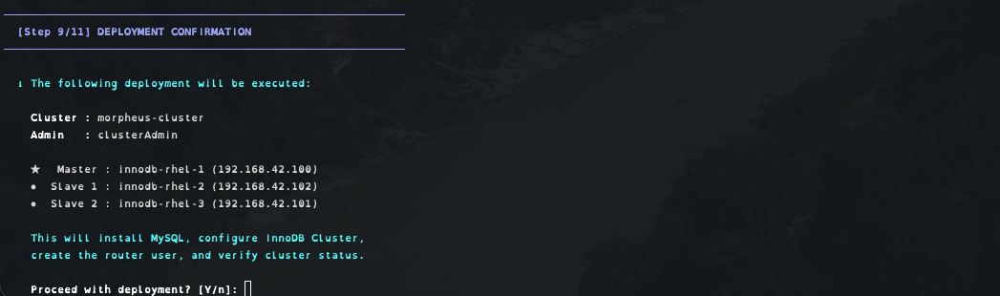

The playbook does the following, in this order:

1. Pre-tasks remove the node's own name from `127.x` lines in `/etc/hosts` (many cloud images map the hostname to loopback, and InnoDB Cluster refuses that), add the three nodes to `/etc/hosts` and set the hostname.
2. Role 01 applies the SSH banner, sets SELinux to permissive or stops AppArmor, stops the host firewall, sets the locale and NTP, raises the limits for the `mysql` user, writes the kernel parameters and disables Transparent Huge Pages.
3. Role 02 installs the selected MySQL version and MySQL Shell, adds a systemd drop-in that starts `mysqld` under `numactl --interleave=all`, and sets the root password.
4. Role 03 writes `innodb-mysqld.cnf` with GTID enabled, invisible primary keys on, the buffer pool at 80% of RAM and a `server_id` derived from the node's full IP address, so it stays unique when a second site in another subnet joins a ClusterSet later. It then creates the cluster admin user without writing it to the binary log, which keeps the nodes free of errant GTIDs.
5. Role 04 runs on the master only. A single MySQL Shell script configures the three instances, creates the cluster (or reuses an existing one), adds the two secondaries with clone recovery, creates or updates the MySQL Router account and prints `cluster.status()`.

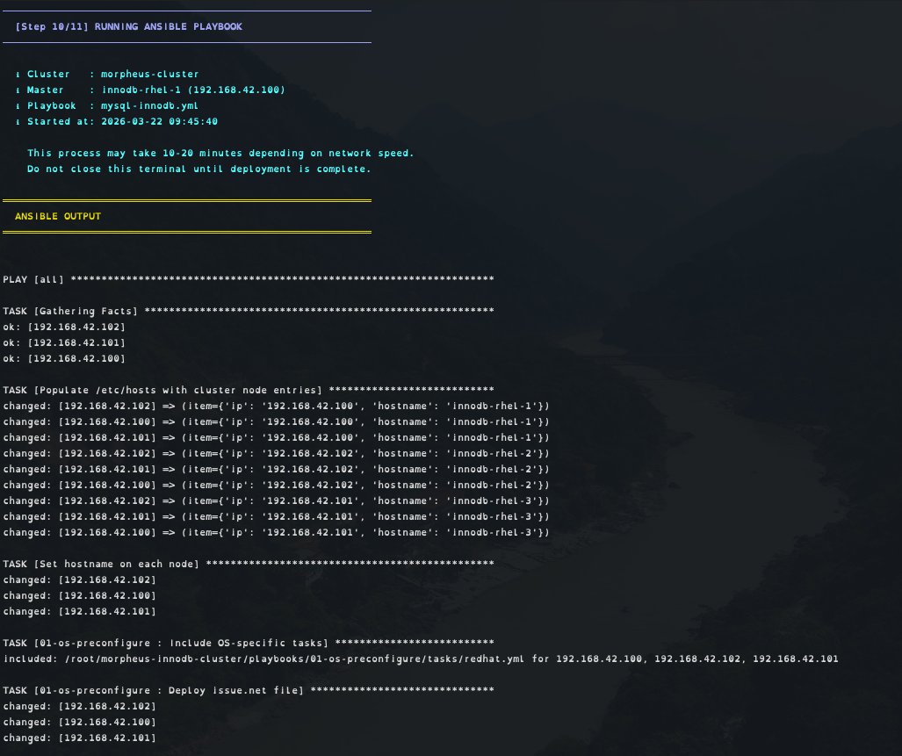

On our three-node lab the whole playbook takes about five minutes.

### Step 6/6 — Setup Report

At the end the script writes `cluster_setup_report.txt` with the result, the duration, the play recap per node and the commands you need next.

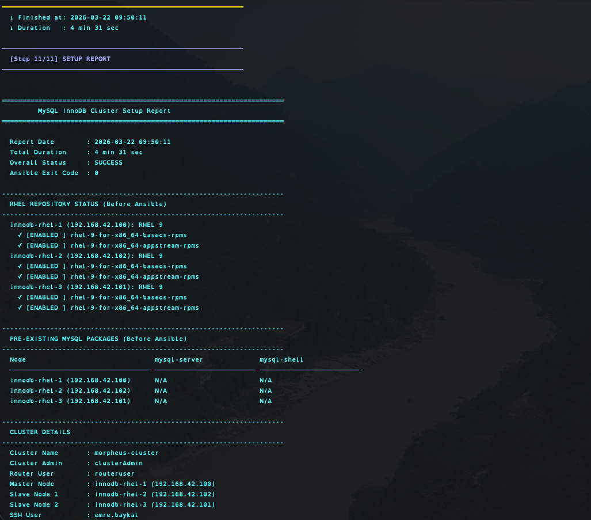

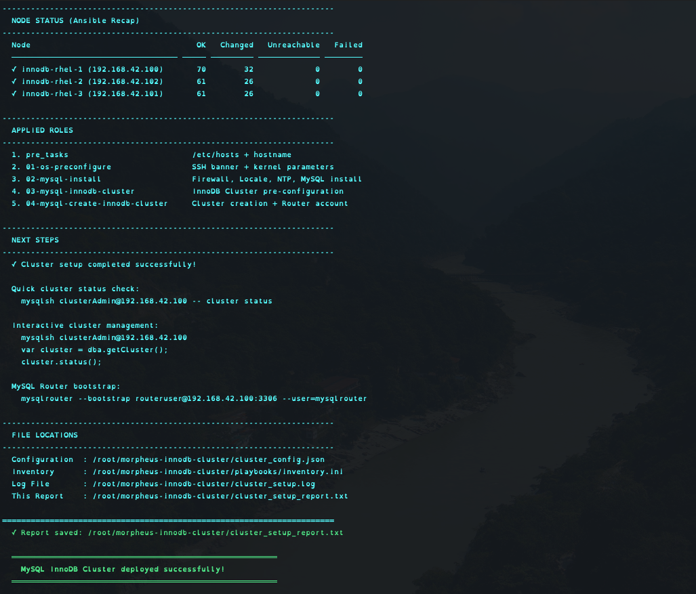

```bash
# Quick cluster status check
mysqlsh clusterAdmin@<master-ip> -- cluster status

# Bootstrap MySQL Router (run on each Morpheus app node)
mysqlrouter --bootstrap routeruser@<master-ip>:3306 --user=mysqlrouter
```

---

## What Makes This Project Different

### Safe to Re-run

You can run the script again on an existing cluster. It detects the cluster and its members and leaves them alone, the root password and cluster admin user are only created when they are missing, and a node that already has a `server_id` keeps it, since changing it on a running member breaks recovery. If something fails halfway, fix the cause and run the script again.

### One Script, Two OS Families

The same playbook covers RHEL 9/10 and Ubuntu 24.04/26.04. The differences in package sources, service names, configuration paths and security frameworks are handled inside the roles, so you do not maintain two runbooks.

### Tuned for a Database Workload

Beyond getting MySQL running, the roles apply the OS and database settings we use in production: larger TCP backlogs and connection queues, low swappiness, raised file and process limits for the `mysql` user, NUMA interleaving, Transparent Huge Pages off, the buffer pool sized to 80% of RAM, GTID-based replication and seven days of binary logs.

### Careful with Credentials

The configuration file and the inventory are created with mode `0600`, Ansible tasks that handle passwords run with `no_log`, password prompts are not echoed, and the temporary MySQL Shell script is removed after the cluster is built. You can also choose not to store the passwords at all.

---

## Connecting Morpheus to Your New Cluster

Once the InnoDB Cluster is running, you need to bridge it with your Morpheus application nodes. Here's the complete workflow:

### 1. Create the Morpheus Database

Log into your new cluster's primary node and create the database and user that Morpheus expects:

```sql
mysql -u root -p

CREATE DATABASE morpheus CHARACTER SET utf8mb4 COLLATE utf8mb4_general_ci;
CREATE USER 'morpheus'@'%' IDENTIFIED BY 'morpheusDbUserPassword';
GRANT ALL PRIVILEGES ON morpheus.* TO 'morpheus'@'%' WITH GRANT OPTION;
GRANT SELECT, PROCESS, SHOW DATABASES, RELOAD ON *.* TO 'morpheus'@'%';
FLUSH PRIVILEGES;
```

### 2. Bootstrap MySQL Router on Each App Node

Install MySQL Router on each Morpheus application node and bootstrap it against the cluster:

```bash
mysqlrouter --bootstrap routeruser@192.168.42.100:3306 --user=mysqlrouter
systemctl enable mysqlrouter && systemctl start mysqlrouter
```

MySQL Router will automatically discover all cluster members and create local read-write (port 6446) and read-only (port 6447) endpoints.

### 3. Configure Morpheus

Edit `/etc/morpheus/morpheus.rb` on each app node, pointing MySQL to the local router endpoint:

```ruby
mysql['enable'] = false
mysql['host'] = {'127.0.0.1' => 6446}
mysql['morpheus_db'] = 'morpheus'
mysql['morpheus_db_user'] = 'morpheus'
mysql['morpheus_password'] = 'morpheusDbUserPassword'
```

Then reconfigure and proceed with the rest of the Morpheus HA installation:

```bash
morpheus-ctl reconfigure
```

With this setup, **MySQL Router handles automatic failover**. If the primary node goes down, Group Replication elects a new primary, and MySQL Router transparently redirects traffic — all without any Morpheus downtime.

---

## Network Requirements

### MySQL InnoDB Cluster Ports (between DB nodes)

| Port  | Protocol | Service |
|-------|----------|---------|
| 3306  | TCP | MySQL Classic Protocol |
| 33060 | TCP | MySQL X Protocol |
| 33061 | TCP | Group Replication |

### Morpheus App Node to MySQL Cluster

| Port  | Protocol | Service |
|-------|----------|---------|
| 3306  | TCP | MySQL connection (or via Router 6446/6447) |

### Additional Morpheus HA Ports (for reference)

| Port  | Protocol | Service |
|-------|----------|---------|
| 443   | TCP | HTTPS (inbound from users/agents) |
| 4369  | TCP | RabbitMQ EPMD (inter-node discovery) |
| 5671/5672 | TCP | RabbitMQ (TLS/non-TLS) |
| 9200  | TCP | OpenSearch API |
| 9300  | TCP | OpenSearch inter-node |
| 25672 | TCP | RabbitMQ inter-node |
| 61613/61614 | TCP | STOMP (non-TLS/TLS) |

---

## PaaS Alternatives

The HPE documentation also lists supported PaaS offerings as alternatives to self-managed MySQL clusters:

| Cloud | Database (MySQL) |
|-------|-----------------|
| AWS | Amazon Aurora |
| GCP | MySQL Instance |
| Azure | N/A |
| OCI | N/A |
| Alibaba | N/A |

As you can see, PaaS support for MySQL is limited to AWS and GCP. For **on-premises deployments, private cloud, or any other environment**, a self-managed MySQL cluster is your only option — which is exactly what this tool provides.

---

## Conclusion

Setting up a MySQL InnoDB Cluster for HPE Morpheus Enterprise HA shouldn't be a multi-day project requiring deep MySQL expertise. The **morpheus-innodb-cluster** tool reduces it to a single command and a 10-minute guided wizard. It handles OS detection, prerequisite installation, interactive configuration, pre-flight validation, Ansible-driven deployment, and post-deployment reporting — all in one cohesive workflow.

While HPE Morpheus Enterprise excels at automatically clustering OpenSearch and providing the framework for RabbitMQ clustering, the Transactional Database Tier remains the one piece that administrators must provision themselves. This tool fills that gap, giving you a consistent, repeatable, production-ready MySQL InnoDB Cluster every time.

Whether you're deploying Morpheus HA for the first time or rebuilding your database tier after a migration, you're three commands away:

```bash
git clone https://github.com/emrbaykal/morpheus-innodb-cluster.git
cd morpheus-innodb-cluster
sudo python3 innodb_cluster_setup.py
```

---

*If you found this useful, give the [GitHub repository](https://github.com/emrbaykal/morpheus-innodb-cluster) a ⭐ and feel free to open issues or contribute.*

---

## References

- [HPE Morpheus Enterprise v8.1.0 — HA Installation Overview](https://support.hpe.com/hpesc/public/docDisplay?docId=sd00007510en_us&page=GUID-C1061ACC-BCAF-4F7C-A413-2219EAFB7983.html)
- [HPE Morpheus Enterprise v8.1.0 — 3-Node HA Install Example](https://support.hpe.com/hpesc/public/docDisplay?docId=sd00007510en_us&page=GUID-2D8A0A86-2231-4239-AB44-5475B4AE0827.html)
- [MySQL InnoDB Cluster Documentation](https://dev.mysql.com/doc/refman/8.4/en/mysql-innodb-cluster-introduction.html)
- [MySQL Shell — Deploying Production InnoDB Cluster](https://dev.mysql.com/doc/mysql-shell/8.4/en/deploying-production-innodb-cluster.html)
