# Automating MySQL InnoDB Cluster Deployment for HPE Morpheus Enterprise HA Environments

**A single Python script that turns a painful, multi-hour manual process into a guided 10-minute deployment.**

---

> **GitHub Repository:** [https://github.com/emrbaykal/morpheus-innodb-cluster](https://github.com/emrbaykal/morpheus-innodb-cluster)
>
> **Author:** Emre Baykal
>
> **License:** MIT

---

## Introduction

If you've ever deployed HPE Morpheus Enterprise in a High Availability (HA) configuration, you know the drill: the application tier, messaging tier, and non-transactional database tier all install and cluster automatically across your three nodes — but the **Transactional Database Tier** is left entirely in your hands. That tier is MySQL, and for a production HA environment, it needs to be a properly configured, redundant, multi-node cluster.

As the [HPE Morpheus Enterprise v8.1.0 HA Installation Overview](https://support.hpe.com/hpesc/public/docDisplay?docId=sd00007510en_us&page=GUID-C1061ACC-BCAF-4F7C-A413-2219EAFB7983.html) clearly states:

> *"In this architecture, all tiers are deployed on three machines by HPE Morpheus Enterprise during the installation, with the exception of the Transactional Database Tier. This provides HA not just for the HPE Morpheus Enterprise Application Tier but all underlying tiers that support HPE Morpheus Enterprise. The Transactional Database Tier will remain external, either as a separate cluster or PaaS, following the supported services. An external MySQL cluster must still be set up outside of the HPE Morpheus Enterprise app nodes."*

This means **you** are responsible for standing up a resilient, properly tuned MySQL cluster **before** you can even begin the Morpheus HA installation. There is no embedded option — Morpheus disables its internal MySQL (`mysql['enable'] = false`) and expects you to provide an external endpoint.

This is where the **morpheus-innodb-cluster** project comes in. It is a single interactive Python script, backed by modular Ansible roles, that automates the entire process of deploying a production-ready 3-node MySQL InnoDB Cluster on Ubuntu or RHEL-based systems.

In this post, I'll walk you through why this tool exists, what problems it solves, and how to use it from start to finish.

---

## Understanding HPE Morpheus Enterprise HA Architecture

HPE Morpheus Enterprise is a unified hybrid cloud management platform that provides provisioning, orchestration, monitoring, and governance across private and public clouds. It can start as a simple single-machine instance where all services run together, or it can be split into individual services per machine and configured in a high availability (HA) configuration — either in the same region or cross-region.

According to the official HPE documentation (v8.1.0, February 2026), there are **four primary tiers** of services within the Morpheus appliance:

### 1. Application Tier

The stateless services layer — Nginx and Tomcat. These can be installed across all regions and placed behind a central load balancer or geo-based load balancer. They connect to all other tiers, as none of the other tiers communicate with each other except through the application tier. Shared storage (NFS, Amazon S3, or OpenStack Swift) is required for deployment archives, virtual image catalogs, and backups.

### 2. Transactional Database Tier (MySQL)

This is the focus of this article. The HPE documentation states: *"The Transactional Database tier consists of a MySQL compatible database. It is recommended that a lockable clustered configuration be used, such as a Galera cluster, which can also provide high availability."* For the recommended 3-Node HA architecture, this tier **must be external** — it is not deployed by the Morpheus installer.

### 3. Non-Transactional Database Tier (OpenSearch)

Used for log aggregation, stats, metrics, and temporal data. OpenSearch is a clustered database where all nodes need to be connected via the "Transport" protocol. Morpheus clusters OpenSearch **automatically** during installation — no manual setup required.

### 4. Messaging Tier (RabbitMQ)

An AMQP-based tier with STOMP protocol for agent communication. RabbitMQ needs at least 3 instances for HA configurations due to quorum-based elections in failover scenarios. While RabbitMQ is installed automatically during Morpheus setup, it **does require manual clustering** afterward — a multi-step process involving secret synchronization, erlang cookie distribution, and node-by-node join operations.

### The Architecture

The recommended 3-Node HA deployment looks like this: three Morpheus application nodes sit behind a load balancer, each running embedded RabbitMQ and OpenSearch. On the side, a **separate 3-node MySQL Database Cluster** provides the transactional database tier, connected via port 3306. Shared storage connects to all application nodes.

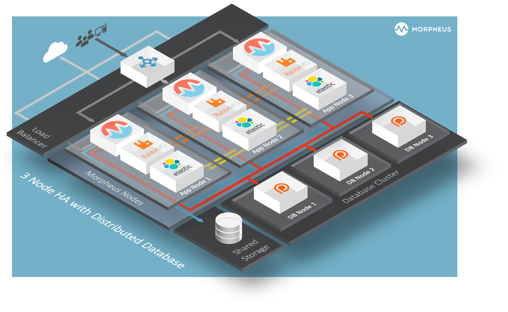

---

## MySQL Requirements for Morpheus HA

The [HPE 3-Node HA Install documentation](https://support.hpe.com/hpesc/public/docDisplay?docId=sd00007510en_us&page=GUID-2D8A0A86-2231-4239-AB44-5475B4AE0827.html) specifies the following MySQL requirements:

- **MySQL version v8.0.x** (minimum of v8.0.72)
- **MySQL cluster with at least 3 nodes** for redundancy
- **Morpheus application nodes must have connectivity** to the MySQL cluster

There is also an important note: *"Morpheus does not create primary keys on all tables. If you use a clustering technology that requires primary keys, you will need to leverage the invisible primary key option in MySQL 8."*

Once the MySQL cluster is up, you must create the Morpheus database and user before installing Morpheus itself:

```sql
-- Create the Morpheus database
CREATE DATABASE morpheus CHARACTER SET utf8mb4 COLLATE utf8mb4_general_ci;

-- Create the Morpheus database user
CREATE USER 'morpheus'@'%' IDENTIFIED BY 'morpheusDbUserPassword';

-- Grant required permissions
GRANT ALL PRIVILEGES ON morpheus.* TO 'morpheus'@'%' WITH GRANT OPTION;
GRANT SELECT, PROCESS, SHOW DATABASES, RELOAD ON *.* TO 'morpheus'@'%';
FLUSH PRIVILEGES;
```

Then, in each Morpheus app node's `/etc/morpheus/morpheus.rb`, you configure:

```ruby
mysql['enable'] = false
mysql['host'] = {'127.0.0.1' => 6446}   # MySQL Router local endpoint
mysql['morpheus_db'] = 'morpheus'
mysql['morpheus_db_user'] = 'morpheus'
mysql['morpheus_password'] = 'morpheusDbUserPassword'
```

Notice `mysql['enable'] = false` — this tells Morpheus to skip its embedded MySQL and use your external cluster instead. The host points to `127.0.0.1:6446`, which is the MySQL Router read-write endpoint running locally on each app node.

---

## The Pain of Manual MySQL InnoDB Cluster Setup

Now here's the problem: the HPE documentation tells you that you need an external MySQL cluster, but it doesn't deploy one for you. You're on your own. And setting up a MySQL InnoDB Cluster by hand is not a trivial task. Here's what you're typically facing:

### 1. Repetitive Per-Node Configuration

Every single node in the cluster needs identical preparation: OS tuning, kernel parameter adjustments, firewall rules for ports 3306, 33060, and 33061, NTP synchronization, locale settings, and MySQL installation. With three nodes, you're doing the same work three times — and any inconsistency between nodes can cause silent failures down the line.

### 2. MySQL Installation Complexity

Installing MySQL involves adding the correct repository for your OS version, selecting the right MySQL stream and version, managing package locks to prevent accidental upgrades, and configuring the service with appropriate systemd overrides. On RHEL systems, you also have to deal with AppStream module conflicts and subscription-manager repositories. Remember — Morpheus requires MySQL v8.0.x minimum v8.0.72, so version selection matters.

### 3. InnoDB-Specific Tuning

MySQL doesn't come pre-configured for InnoDB Cluster. You need to enable GTID mode, enforce GTID consistency, set a unique `server_id` on each node, tune `innodb_buffer_pool_size` to match your available RAM, configure binary log expiration, and set bind addresses correctly. A single misconfiguration can prevent the cluster from forming entirely.

### 4. Cluster Bootstrap Choreography

Once MySQL is installed and configured on all three nodes, you need to use MySQL Shell to run `dba.configureInstance()` on each node, then `dba.createCluster()` on the primary, then `cluster.addInstance()` for each secondary with the correct recovery method. You also need to create a router user account and verify the cluster status. The order of operations matters — errors at any step can leave you in a partially configured state that's hard to recover from.

### 5. Security Considerations

Throughout this process, you're handling MySQL root passwords, cluster admin credentials, SSH keys, and sudo escalation — all of which need to be managed securely. Leaving temporary credential files on disk, using weak authentication plugins, or failing to set proper file permissions are common mistakes in manual setups.

### 6. OS-Specific Differences

The steps differ significantly between Ubuntu/Debian and RHEL. Repository management, package names, service names, configuration file paths, security frameworks (AppArmor vs. SELinux), and even the NTP daemon are all different. Maintaining two separate runbooks for the same logical deployment is error-prone and hard to keep in sync.

### 7. The RabbitMQ Comparison

To put this in perspective, look at how much manual work the HPE documentation already requires just for RabbitMQ clustering — which is embedded and partially automatic. The 3-Node HA Install guide dedicates an entire section to manually stopping services, copying erlang cookies, synchronizing secrets, joining nodes, and reconfiguring. Now imagine doing something *even more complex* for a completely external MySQL cluster that has to be ready *before* Morpheus is installed.

---

## Introducing morpheus-innodb-cluster

The **morpheus-innodb-cluster** project eliminates all of this manual toil. It is a single Python script (`innodb_cluster_setup.py`) that orchestrates the entire deployment through an interactive 11-step wizard, backed by four modular Ansible roles that handle the actual configuration work.

### Architecture at a Glance

```
You (on master node)
  └── innodb_cluster_setup.py  (Python orchestrator)
        ├── Step 1-9:  Interactive wizard (collect & validate)
        └── Step 10:   Ansible playbook execution
              ├── Role 01: OS Pre-configuration
              ├── Role 02: MySQL Installation
              ├── Role 03: InnoDB Cluster Pre-configuration
              └── Role 04: Cluster Creation (master only)
        └── Step 11:   Setup Report
```

The script is designed to run **from the master node** of the cluster. It installs its own dependencies (Ansible, sshpass, community.mysql collection), connects to all three nodes via SSH, and executes the Ansible playbook that does the heavy lifting. You don't need to pre-install anything other than Python 3.6+ and sudo access.

---

## Step-by-Step Walkthrough

Let's walk through the entire deployment process, using screenshots from a real deployment on RHEL 9 nodes.

### Getting Started

Clone the repository and run the script on the node you want to be the **primary (master)** node:

```bash
git clone https://github.com/emrbaykal/morpheus-innodb-cluster.git
cd morpheus-innodb-cluster
sudo python3 innodb_cluster_setup.py
```

### Step 1/11 — Environment Setup

The script begins by detecting your operating system family and automatically installing all required prerequisites. On RHEL systems, it checks for the Ansible Automation Platform repository in subscription-manager; if it's not enabled, the script gracefully falls back to installing Ansible via pip3.

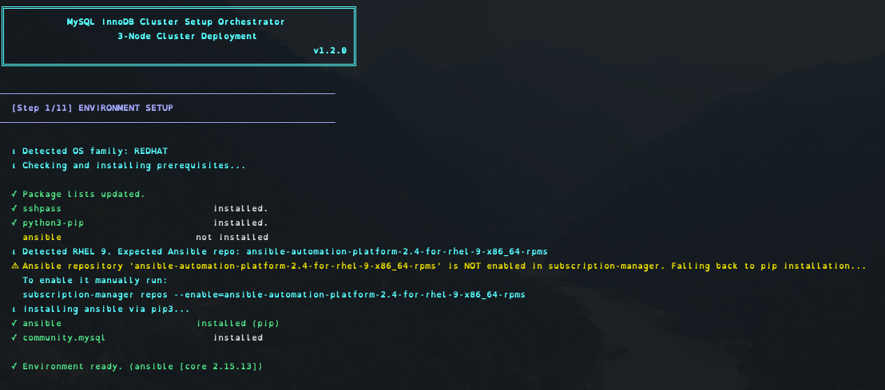

In the screenshot above, you can see the tool detecting RHEL 9, installing `sshpass` and `python3-pip` via the OS package manager, falling back to pip for Ansible (since the AAP repository wasn't enabled in subscription-manager), and installing the `community.mysql` Ansible collection. The entire environment is ready in seconds.

### Step 2/11 — Cluster Configuration

This is the heart of the wizard. It collects all the information needed in five organized sections:

**Section 1/5 — Cluster Nodes:** You provide the hostname and IP address for each of the three cluster nodes. The first node is automatically designated as the master (primary), and the other two become secondaries. Each entry is validated for connectivity immediately.

**Section 2/5 — SSH Connection:** The script asks for the SSH user, key file (or password), privilege escalation method (sudo or dzdo), and sudo password. This is how Ansible will connect to all three nodes.

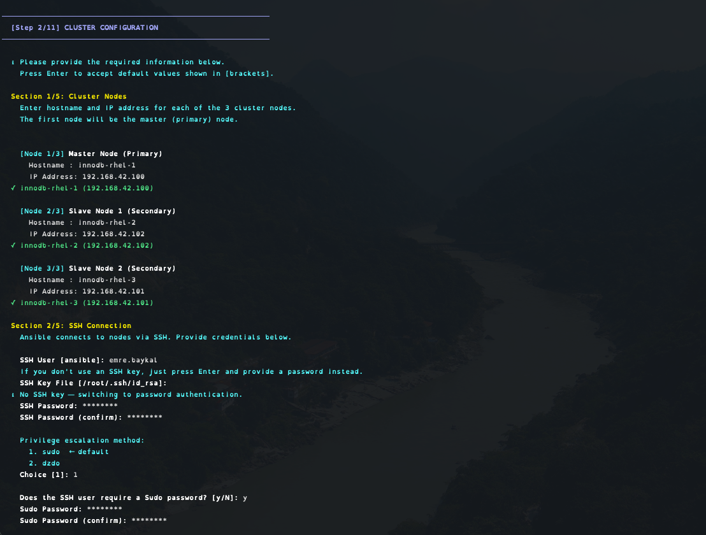

**Section 3/5 — MySQL Credentials:** You set the MySQL root password and the InnoDB Cluster admin credentials. The cluster admin user (default: `clusterAdmin`) is the account that will manage the InnoDB Cluster.

**Section 4/5 — Cluster Settings:** You name your cluster (in our case, `morpheus-cluster`) and set a password for the MySQL Router user account (`routeruser`) that will be created for application connectivity.

**Section 5/5 — System Settings:** NTP server configuration for time synchronization across all nodes — critical for Group Replication to function correctly.

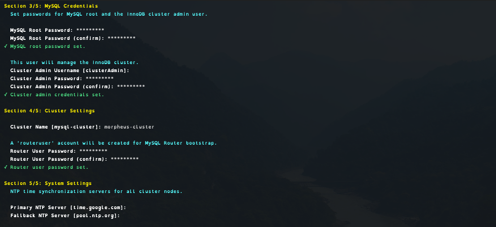

### Configuration Summary

Before anything is written to disk or executed, the script presents a complete summary table of everything you've entered — cluster nodes with IPs, SSH connection details, MySQL configuration, and system settings. You review and confirm with `y` before proceeding.

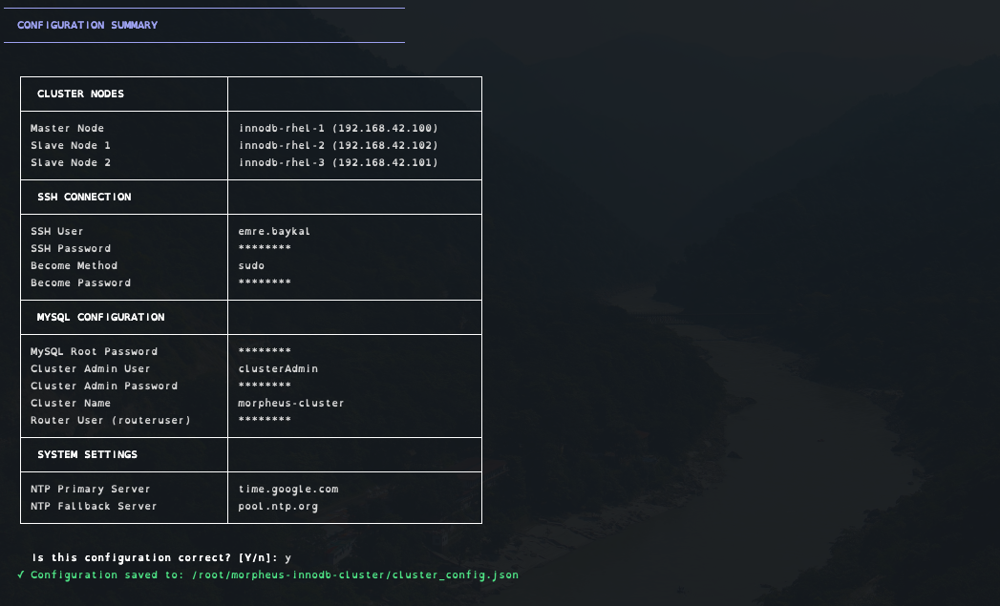

This is a safety net. All passwords are masked, and the configuration is saved to `cluster_config.json` with mode `0600` so it can be reused on subsequent runs without re-entering everything.

### Steps 3–4 — Inventory Generation & SSH Connectivity Test

The script generates an Ansible inventory file from your inputs and then tests SSH connectivity to every node. This catches authentication problems, firewall issues, or unreachable hosts **before** the deployment begins.

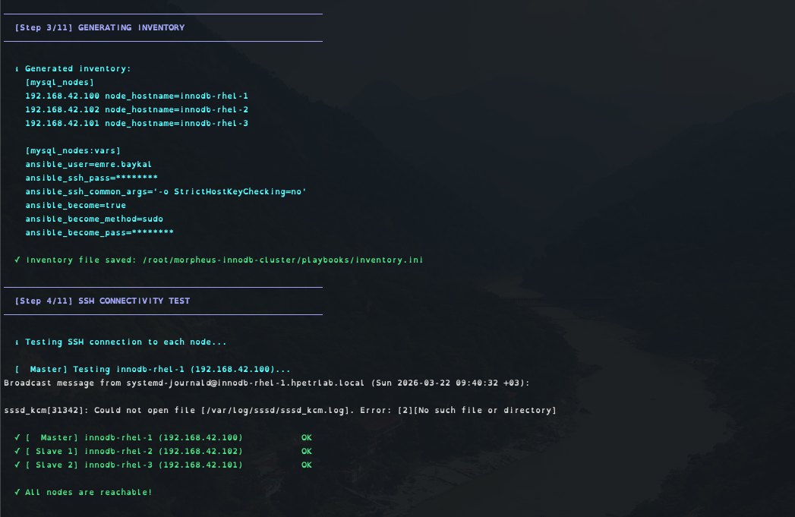

In our deployment, all three nodes — `innodb-rhel-1` (192.168.42.100), `innodb-rhel-2` (192.168.42.102), and `innodb-rhel-3` (192.168.42.101) — came back as reachable. The inventory uses IP addresses throughout, making the deployment DNS-independent. Note the `ansible_ssh_common_args='-o StrictHostKeyChecking=no'` setting, which prevents SSH from blocking first-time connections.

### Steps 5–8 — Pre-Flight Checks & MySQL Version Selection

The script performs three validation checks before deployment:

**Step 5 — RHEL Repository Check:** Verifies that `rhel-9-for-x86_64-baseos-rpms` and `rhel-9-for-x86_64-appstream-rpms` are enabled on all nodes. These repositories are required for MySQL dependencies.

**Step 6 — Pre-Flight MySQL Package Check:** Scans all nodes for pre-existing `mysql-server` and `mysql-shell` installations that could cause conflicts. A clean slate ensures a predictable deployment.

**Step 7 — Internet Connectivity Check:** Tests that all nodes can reach `dev.mysql.com` to download MySQL packages.

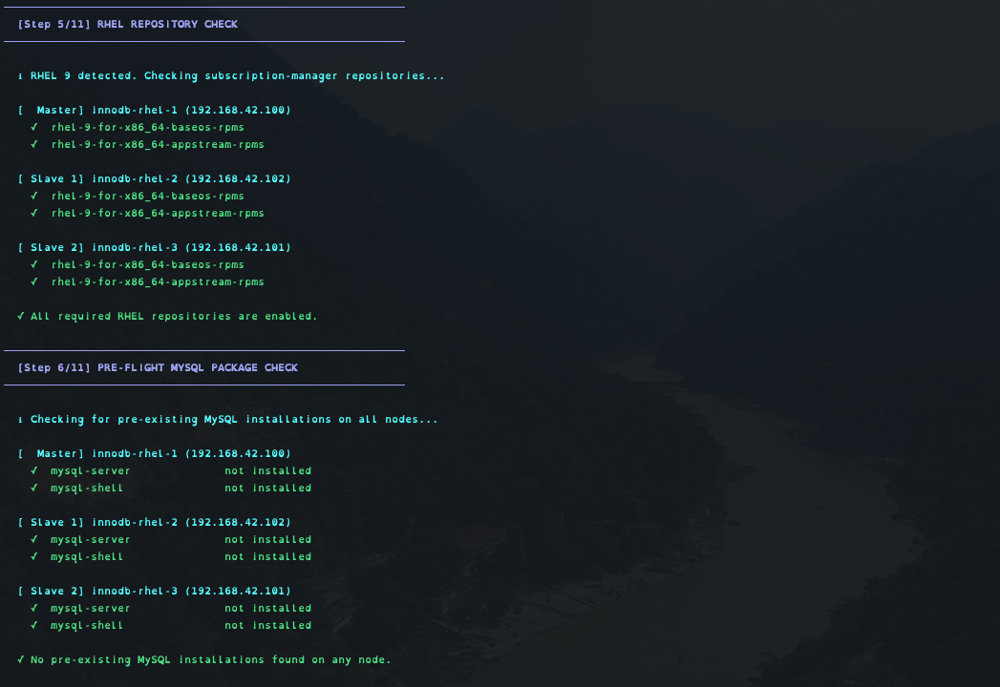

**Step 8 — MySQL Version Selection:** On RHEL systems, the script presents the available MySQL AppStream streams (8.0 and 8.4) and then lists the specific versions within your chosen stream. In our deployment, we selected **MySQL 8.4.7** from the 8.4 LTS stream — well above the HPE minimum requirement of v8.0.72.

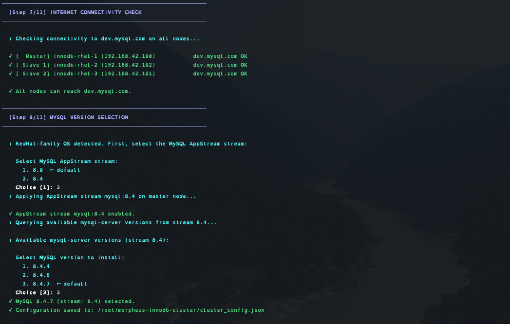

### Step 9/11 — Deployment Confirmation

A final confirmation screen shows exactly what will be deployed: the cluster name (`morpheus-cluster`), admin user (`clusterAdmin`), and all three nodes with their roles. The master node is marked with a star.

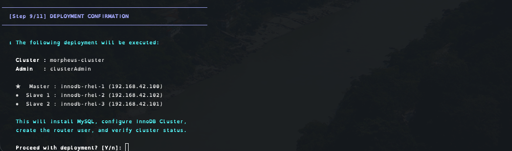

### Step 10/11 — Ansible Playbook Execution

Once you confirm, the Ansible playbook executes with real-time streaming output. You can watch every task as it runs across all three nodes. The playbook applies five roles in sequence:

1. **pre_tasks** — Populates `/etc/hosts` with cluster node entries and sets hostnames on all nodes
2. **01-os-preconfigure** — Deploys SSH banners, disables SELinux/AppArmor, configures firewall rules (ports 3306, 33060, 33061), sets locale, installs and configures NTP (chrony/systemd-timesyncd), tunes kernel parameters for database workloads, disables Transparent Huge Pages, and sets MySQL-specific system limits
3. **02-mysql-install** — Adds the MySQL repository, selects the AppStream stream/version, installs MySQL Server and MySQL Shell, configures systemd overrides with NUMA interleaving, and sets the root password
4. **03-mysql-innodb-cluster** — Creates the cluster admin user, removes anonymous users, drops the test database, writes InnoDB-optimized `my.cnf` configuration (with buffer pool auto-sized to 80% of RAM), enables GTID mode, and restarts MySQL
5. **04-mysql-create-innodb-cluster** — Runs on the master node only: configures instances via `dba.configureInstance()` in MySQL Shell, creates the cluster with `dba.createCluster()`, adds secondary nodes with clone-based recovery, verifies cluster status, and creates the `routeruser` account

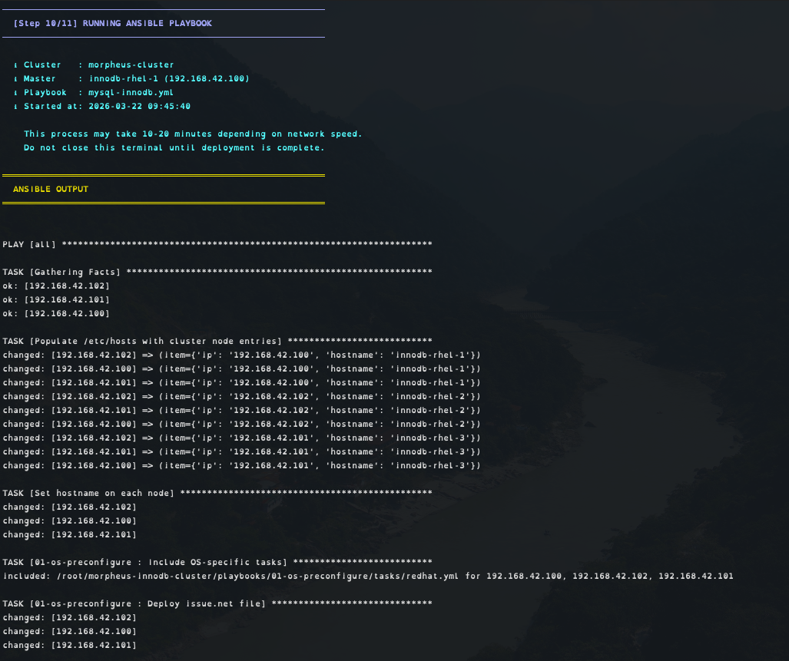

In our deployment, the entire Ansible playbook completed in **4 minutes and 31 seconds** with zero failures across all three nodes.

### Step 11/11 — Setup Report

After completion, the script generates a comprehensive setup report that includes everything you need to verify and manage your new cluster.

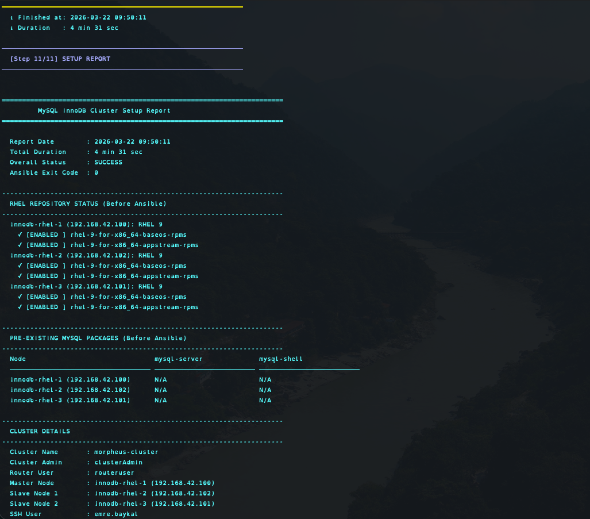

The **NODE STATUS** section shows the Ansible PLAY RECAP for each node — in our deployment, the master node had 70 OK / 32 Changed tasks, while each secondary had 61 OK / 26 Changed, with zero unreachable or failed across the board.

The **APPLIED ROLES** section shows what each role did, and the **NEXT STEPS** section provides ready-to-use commands:

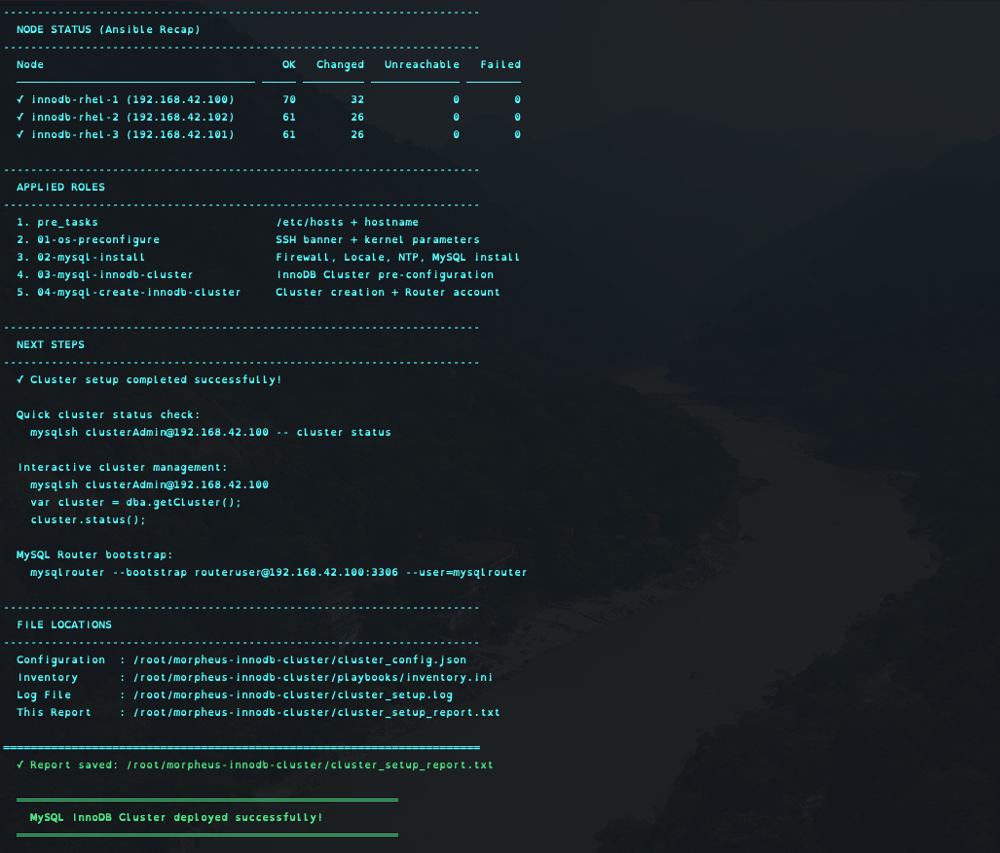

```bash
# Quick cluster status check
mysqlsh clusterAdmin@192.168.42.100 -- cluster status

# Interactive cluster management
mysqlsh clusterAdmin@192.168.42.100
var cluster = dba.getCluster();
cluster.status();

# Bootstrap MySQL Router (run on each Morpheus app node)
mysqlrouter --bootstrap routeruser@192.168.42.100:3306 --user=mysqlrouter
```

---

## What Makes This Project Different

### Truly Idempotent

The entire workflow is safe to re-run. The script saves your configuration to `cluster_config.json` and offers to reuse it on subsequent runs. Ansible tasks check the current state before making changes. MySQL root password handling tries socket authentication first, then falls back to the existing password.

### OS-Aware Automation

The Ansible roles automatically detect `ansible_os_family` and execute the appropriate tasks for each distribution. Whether you're running Ubuntu 22.04, Ubuntu 24.04, RHEL 8, or RHEL 9, the same script handles everything — from repository management and package names to configuration file paths and service names.

### Production-Grade Tuning

This isn't just a "get MySQL running" script. It applies production-grade OS and database tuning:

- **Kernel parameters:** TCP backlog, connection queue, TIME_WAIT reuse, swap minimization, dirty page ratios, file descriptor limits, and async I/O limits
- **MySQL limits:** 65,535 open files, 65,535 processes, unlimited memory lock
- **NUMA interleaving:** MySQL runs with `numactl --interleave=all` for optimal memory access on multi-socket servers
- **InnoDB buffer pool:** Automatically sized to 80% of total RAM
- **GTID-based replication:** Required for InnoDB Cluster and enabled automatically
- **Binary log management:** Automatic purge after 7 days

### Security by Default

All generated configuration files are created with mode `0600`. Passwords are never logged (Ansible `no_log: true`). Terminal input is masked for all password prompts. Temporary credential files in `/tmp/` are cleaned up after cluster creation.

---

## Connecting Morpheus to Your New Cluster

Once the InnoDB Cluster is running, you need to bridge it with your Morpheus application nodes. Here's the complete workflow:

### 1. Create the Morpheus Database

Log into your new cluster's primary node and create the database and user that Morpheus expects:

```sql
mysql -u root -p

CREATE DATABASE morpheus CHARACTER SET utf8mb4 COLLATE utf8mb4_general_ci;
CREATE USER 'morpheus'@'%' IDENTIFIED BY 'morpheusDbUserPassword';
GRANT ALL PRIVILEGES ON morpheus.* TO 'morpheus'@'%' WITH GRANT OPTION;
GRANT SELECT, PROCESS, SHOW DATABASES, RELOAD ON *.* TO 'morpheus'@'%';
FLUSH PRIVILEGES;
```

### 2. Bootstrap MySQL Router on Each App Node

Install MySQL Router on each Morpheus application node and bootstrap it against the cluster:

```bash
mysqlrouter --bootstrap routeruser@192.168.42.100:3306 --user=mysqlrouter
systemctl enable mysqlrouter && systemctl start mysqlrouter
```

MySQL Router will automatically discover all cluster members and create local read-write (port 6446) and read-only (port 6447) endpoints.

### 3. Configure Morpheus

Edit `/etc/morpheus/morpheus.rb` on each app node, pointing MySQL to the local router endpoint:

```ruby
mysql['enable'] = false
mysql['host'] = {'127.0.0.1' => 6446}
mysql['morpheus_db'] = 'morpheus'
mysql['morpheus_db_user'] = 'morpheus'
mysql['morpheus_password'] = 'morpheusDbUserPassword'
```

Then reconfigure and proceed with the rest of the Morpheus HA installation:

```bash
morpheus-ctl reconfigure
```

With this setup, MySQL Router handles automatic failover. If the primary node goes down, Group Replication elects a new primary, and MySQL Router transparently redirects traffic — all without any Morpheus downtime.

---

## Network Requirements

### MySQL InnoDB Cluster Ports (between DB nodes)

| Port  | Protocol | Service |
|-------|----------|---------|
| 3306  | TCP | MySQL Classic Protocol |
| 33060 | TCP | MySQL X Protocol |
| 33061 | TCP | Group Replication |

### Morpheus App Node to MySQL Cluster

| Port  | Protocol | Service |
|-------|----------|---------|
| 3306  | TCP | MySQL connection (or via Router 6446/6447) |

### Additional Morpheus HA Ports (for reference)

| Port  | Protocol | Service |
|-------|----------|---------|
| 443   | TCP | HTTPS (inbound from users/agents) |
| 4369  | TCP | RabbitMQ EPMD (inter-node discovery) |
| 5671/5672 | TCP | RabbitMQ (TLS/non-TLS) |
| 9200  | TCP | OpenSearch API |
| 9300  | TCP | OpenSearch inter-node |
| 25672 | TCP | RabbitMQ inter-node |
| 61613/61614 | TCP | STOMP (non-TLS/TLS) |

---

## PaaS Alternatives

The HPE documentation also lists supported PaaS offerings as alternatives to self-managed MySQL clusters:

| Cloud | Database (MySQL) |
|-------|-----------------|
| AWS | Amazon Aurora |
| GCP | MySQL Instance |
| Azure | N/A |
| OCI | N/A |
| Alibaba | N/A |

As you can see, PaaS support for MySQL is limited to AWS and GCP. For **on-premises deployments, private cloud, or any other environment**, a self-managed MySQL cluster is your only option — which is exactly what this tool provides.

---

## Conclusion

Setting up a MySQL InnoDB Cluster for HPE Morpheus Enterprise HA shouldn't be a multi-day project requiring deep MySQL expertise. The **morpheus-innodb-cluster** tool reduces it to a single command and a 10-minute guided wizard. It handles OS detection, prerequisite installation, interactive configuration, pre-flight validation, Ansible-driven deployment, and post-deployment reporting — all in one cohesive workflow.

While HPE Morpheus Enterprise excels at automatically clustering OpenSearch and providing the framework for RabbitMQ clustering, the Transactional Database Tier remains the one piece that administrators must provision themselves. This tool fills that gap, giving you a consistent, repeatable, production-ready MySQL InnoDB Cluster every time.

Whether you're deploying Morpheus HA for the first time or rebuilding your database tier after a migration, you're three commands away:

```bash
git clone https://github.com/emrbaykal/morpheus-innodb-cluster.git
cd morpheus-innodb-cluster
sudo python3 innodb_cluster_setup.py
```

---

*If you found this useful, give the [GitHub repository](https://github.com/emrbaykal/morpheus-innodb-cluster) a star and feel free to open issues or contribute.*

---

**References:**

- [HPE Morpheus Enterprise v8.1.0 — HA Installation Overview](https://support.hpe.com/hpesc/public/docDisplay?docId=sd00007510en_us&page=GUID-C1061ACC-BCAF-4F7C-A413-2219EAFB7983.html)
- [HPE Morpheus Enterprise v8.1.0 — 3-Node HA Install Example](https://support.hpe.com/hpesc/public/docDisplay?docId=sd00007510en_us&page=GUID-2D8A0A86-2231-4239-AB44-5475B4AE0827.html)
- [MySQL InnoDB Cluster Documentation](https://dev.mysql.com/doc/refman/8.4/en/mysql-innodb-cluster-introduction.html)
- [MySQL Shell — Deploying Production InnoDB Cluster](https://dev.mysql.com/doc/mysql-shell/8.4/en/deploying-production-innodb-cluster.html)
